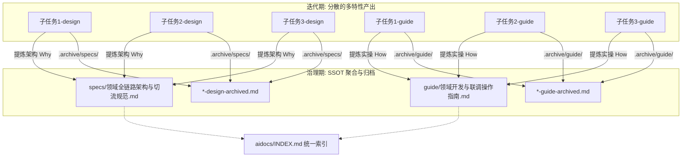

# lean-docs 特性群治理与单一真理源（SSOT）聚合标准

> **文档标识**：`aidocs/guide/lean-docs特性群治理标准.md`
> **所属领域**：文档工程化与瘦身治理规范（Methodology & Standard）
> **版本**：v1.3.0 沉淀标准
> **适用场景**：多子任务/连续切流迭代完成后的文档体系收敛与单一真理源（SSOT）提炼

---

## 1. 业务背景与问题定义

在大型重构、微服务迁移（如 Member ➡️ UMC）、多模块升级等工程项目中，通常会经历多轮细分子特性的连续迭代。每个子特性开发时往往遵循标准五维规范独立产出了：
- 独立的实施计划（`plan/`）与进度追踪（`tracking/`）
- 独立的技术设计（`specs/*-design.md`）
- 独立的操作指南（`guide/*-guide.md`）

### 1.1 核心痛点
当这一批子任务全部交付并验收完成后，系统会出现以下严重问题：
1. **单一真理源（SSOT）破裂**：查阅该领域的整体架构需要跨 8~10 个散碎文档拼凑，且文档中残留着大量开发中期的“待实施”、“待确认”等过时状态；
2. **知识检索噪音膨胀**：全局索引（`INDEX.md`）膨胀，AI 工具与开发者在查找核心规范时面临严重的认知负荷与 Token 浪费；
3. **长期活文档流水化**：长期规划（`Roadmap`）与问题清单中充斥着已解决问题的过程讨论，真正的活跃待办被淹没。

---

## 2. 治理核心思想与四大收敛维度

> **核心原则**：文档是随代码演进的知识图谱，不是流水账日志。多特性交付后的终态应当是**高内聚的单一真理源（SSOT）**，所有单次迭代的过程性设计与指南统一退火归档。



### 2.1 四大维度收敛标准

| 维度 | 治理前形态（分散） | 治理后形态（收敛） | 核心内容要求 |
| :--- | :--- | :--- | :--- |
| **Why（技术架构）** | 多个 `specs/*-design.md` 及报告 | 唯一的 `specs/{领域}全链路架构与切流规范.md` | 1. 架构总览与核心设计原则<br>2. 请求层与鉴权分流机制<br>3. 存储与状态模型（Storage & Store）<br>4. 核心时序与交互流程<br>5. 领域基础能力与数据模型<br>6. 常见排错与 FAQ |
| **How（实操手册）** | 多个 `guide/*-guide.md` | 唯一的 `guide/{领域}开发与联调操作指南.md` | 1. 统一调用与环境规范<br>2. 核心 API 封装调用代码范例<br>3. 端到端全链路人工联调验收清单（Checklist）<br>4. 开发者高频问题 FAQ |
| **What/Track（规划与待办）** | 充斥过程流水账的长期规划与问题清单 | 精简后的 `A_xxx-长期规划.md`<br>+ `A_xxx-问题与待确认清单.md` | 1. 规划收敛为「阶段达成全景图」与「全量资产处置总表」<br>2. 清单收敛为「极简真实待办（TODO）」+「结构化决策闭环总表」 |
| **Archive（生命周期归档）** | 原地保留的大量历史过程文件 | 移入 `aidocs/.archive/{象限}/` | 原文档追加 `-archived.md` 后缀移入归档目录，并在 `INDEX.md` 中做收敛概括统计 |

---

## 3. 标准执行工作流（SOP）

当在项目中执行 `/lean-docs` 或提出“精简/治理文档”时，AI 助手按以下 5 步标准化执行：

### Step 1：特性群识别与依赖扫描
- 扫描 `aidocs/specs/` 与 `aidocs/guide/`，识别属于同一业务领域（如 `umc*`、`pay*`、`order*`）的一组已交付文档；
- 检查是否存在配套的长期规划（`A_*.md`）或问题清单；
- 确认相关业务代码已合并或切流完成。

### Step 2：治理方案预览与授权确认（Dry-Run Gate）
向用户明确输出治理提案，严禁静默覆盖：
```markdown
⚠️ 检测到【{领域名}】下 8 项子特性已全部交付完成，建议执行特性群 SSOT 聚合治理：

1. 拟新建/合并的单一真理源：
   - `aidocs/specs/{领域名}全链路架构与切流规范.md`（收敛 Why 维度）
   - `aidocs/guide/{领域名}开发与联调操作指南.md`（收敛 How 维度）
2. 拟精简重构的长期活文档：
   - `aidocs/specs/A_{领域名}-长期规划.md`（收敛全量映射表）
   - `aidocs/specs/A_{领域名}-问题与待确认清单.md`（仅保留真实待办）
3. 拟归档的历史过程文档（共 N 份）：
   - `aidocs/.archive/specs/*-design-archived.md`
   - `aidocs/.archive/guide/*-guide-archived.md`

请确认是否开始执行？
```

### Step 3：提炼并落地 SSOT 核心资产
- **编写架构真理源**：提取各子特性的有效设计，消除已过时的假设，产出结构化技术规范；
- **编写开发者指南**：提炼真实 API 样例，补充端到端真机/联调核验表（Checklist）。

### Step 4：过程文档归档与长期活文档重构
- 将原分散的 `*-design.md` 和 `*-guide.md` 重命名为 `*-archived.md` 并移入 `aidocs/.archive/`；
- 重构长期规划文档，剔除讨论流水，更新为最终达成状态；
- 重构问题清单，将已闭环事项归档为“决策-依据”矩阵表，仅保留真正未完成的 TODO。

### Step 5：全局索引（INDEX.md）重构与闭环
- 更新 `aidocs/INDEX.md`，将该领域的 Design 与 Guide 指向新的单一真理源；
- 更新历史归档文档计数；
- 输出治理总结报告。

---

## 4. 治理质量检验清单（Checklist）

完成特性群治理后，必须逐项通过以下自检：

- [ ] **单一真理源性**：在 `specs/` 和 `guide/` 中，该领域是否均有且仅有一篇当前有效的主文档？
- [ ] **状态时态一致性**：新生成的规范中，是否已将“待实施”、“候选方案”等中途推导状态修正为“已生效/当前实现”？
- [ ] **真实待办纯粹性**：问题清单第一屏是否能一眼看清真正未完成的事项，无已打钩历史条目的视觉干扰？
- [ ] **归档规范性**：所有归档文件是否均存放于 `aidocs/.archive/{象限}/` 且带有 `-archived.md` 后缀？
- [ ] **索引无死链**：`aidocs/INDEX.md` 中的所有链接是否均真实有效，无遗漏的需求（`reqs/`）与真理源？
- [ ] **代码零侵入**：治理仅针对文档体系，未触碰任何业务源码与构建逻辑。
